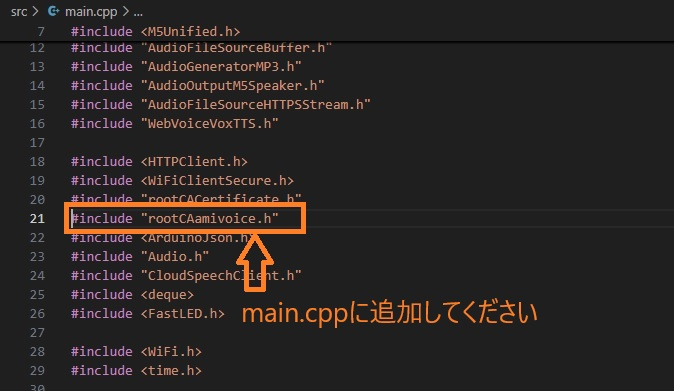
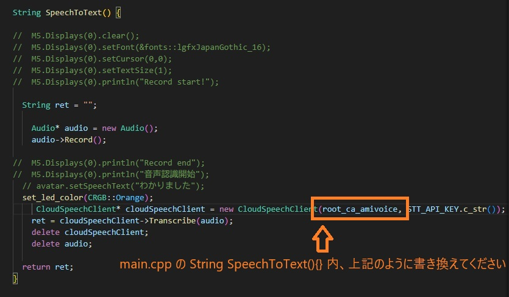
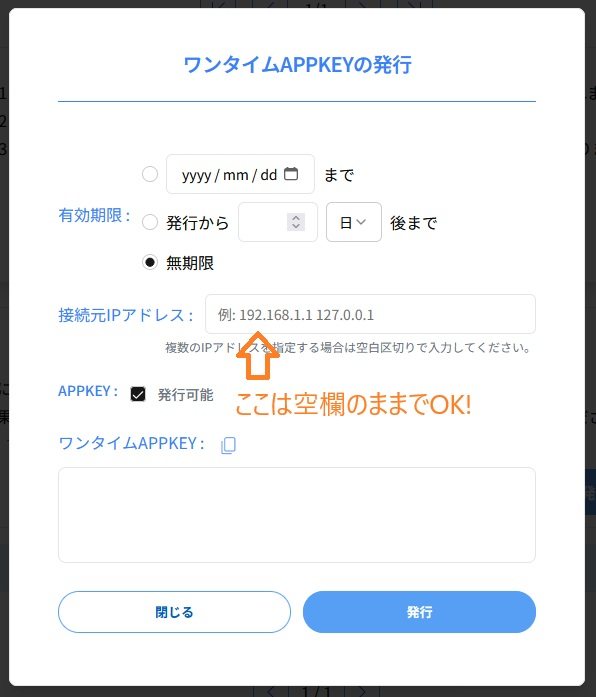

# AmiVoice-for-AI-StackChan

AI StackChanでの音声認識で、 AmiVoiceAPI を利用するときのサンプルプログラムです。

 

Audio.cpp　、CloudSpeechClient.cpp　、CloudSpeechClient.h　は書き換え、rootCAamivoice.h　は追加してください。

 

また、下記画像のようにmain.cpp内を書き換えてください。

 

 

 

補足ですが、AmiVoice API(https://acp.amivoice.com/)でAPI（APP）キーを作る際は下記画像のようにしてください。

 

